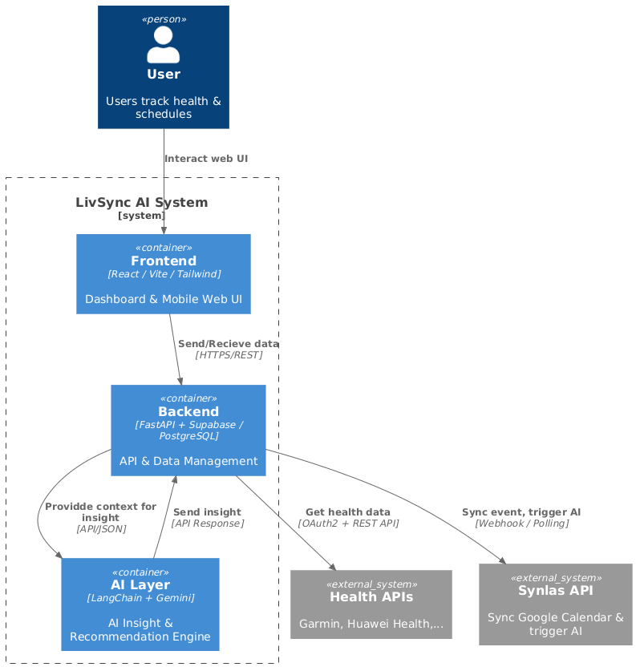

# Technical Write-up: LivSync Health AI Assistant

## High-level Architecture

### System Overview
LivSync is a comprehensive health AI assistant that combines real-time calendar monitoring with personalized health insights. The system follows a microservices architecture with clear separation between the AI backend and web frontend.

### Architecture Components

## AI Models and APIs Used

### Primary AI Model
- **Google Gemini 2.5 Flash**: Main LLM for all AI operations
- **Provider**: Google AI via LangChain integration
- **Model Type**: Large Language Model with tool-calling capabilities
- **Use Case**: Health insights generation, calendar suggestions, natural language processing

### AI Framework
- **LangChain**: Core AI orchestration framework
- **Agent Pattern**: Multi-agent architecture with specialized roles
- **Tool Integration**: Seamless function calling from AI agents

### AI Agent Architecture

#### Agent 1: Health Insights Agent
- **Purpose**: Analyze health data and generate personalized insights
- **Input**: User health data, objectives, calendar schedule
- **Output**: Natural language health recommendations
- **Tools**: User objectives retrieval, health data access, schedule fetching

#### Agent 2: Event Suggestion Agent
- **Purpose**: Generate calendar event suggestions based on health goals
- **Input**: Health objectives, current schedule, health metrics
- **Output**: Structured event suggestions with timing and rationale
- **Tools**: Same as Health Insights Agent but with structured output format

### AI Tools and Function Calling
The system implements three core tools that AI agents can call:
- **User Objectives Tool**: Fetches health goals and step targets from database
- **Health Data Tool**: Retrieves current health metrics and vitals
- **Schedule Tool**: Accesses user's calendar events for today

## Key Design Choices and Challenges

### 1. Multi-Agent Architecture

**What we tried:**
- Single monolithic AI agent handling all health-related tasks
- Separate microservices for each AI function

**What worked:**
- **Specialized Agents**: Each agent has a focused responsibility
- **Shared Tools**: Common data access functions across agents
- **Structured Outputs**: Type-safe responses using Pydantic models

**What didn't work:**
- Single agent became too complex and inconsistent
- Separate services created unnecessary overhead and latency

**Key Challenge Solved:**
- Agent coordination and shared context management
- Consistent tool calling across different agent types

### 2. Real-time Event Processing

**What we tried:**
- Webhook-based calendar integration
- Scheduled batch processing
- Simple polling mechanism

**What worked:**
- **Intelligent Polling**: Event-driven polling with exponential backoff
- **Change Detection**: Sophisticated diff algorithm for event changes
- **Async Processing**: Non-blocking AI suggestion generation

**What didn't work:**
- Webhooks were unreliable with calendar providers
- Batch processing created delays in user experience
- Simple polling caused unnecessary API calls

**Key Challenge Solved:**
- Balancing real-time responsiveness with API rate limits
- Handling calendar provider inconsistencies

### 3. Health Data Integration

**What we tried:**
- Direct integration with health device APIs
- Manual health data entry
- Third-party health platform integration

**What worked:**
- **Mock Data Generation**: Realistic health data simulation with correlations
- **Health Metrics Correlation**: Mathematical relationships between health indicators
- **Caching Strategy**: Persistent mock data for consistent testing

**What didn't work:**
- Direct device integration was complex and unreliable
- Manual entry created user friction
- Third-party platforms had limited API access

**Key Challenge Solved:**
- Creating realistic health data for AI training and testing
- Maintaining data consistency across different health metrics

### 4. Prompt Engineering and AI Behavior

**What we tried:**
- Generic health assistant prompts
- Rule-based health recommendations
- Complex multi-step reasoning prompts

**What worked:**
- **Domain-Specific Prompts**: Health-focused system prompts with medical knowledge
- **Structured Outputs**: Type-safe AI responses using dataclasses
- **Context-Aware Processing**: AI considers user objectives, current data, and schedule

**Key Challenge Solved:**
- Balancing AI flexibility with medical accuracy
- Ensuring consistent, actionable health recommendations

### 5. Performance and Scalability

**What we tried:**
- Synchronous AI processing
- In-memory data storage
- Single-threaded event processing

**What worked:**
- **Async AI Processing**: Non-blocking AI operations using thread pools
- **Persistent Caching**: File-based caching for health data
- **Connection Pooling**: HTTP client management for external APIs

**Key Challenge Solved:**
- Maintaining responsiveness during AI processing
- Handling concurrent user requests efficiently

## Technical Implementation Highlights

### Event Polling Algorithm
The system implements an intelligent polling mechanism with:
- Exponential backoff strategy for error handling
- Random jitter to prevent API collisions
- Lock-based synchronization to prevent overlapping polls
- Change detection algorithm comparing event snapshots

### Health Data Correlation Engine
The health data generator creates realistic correlations between metrics:
- Activity correlation: Steps directly affect distance and calories
- Stress-physiology correlation: Stress levels impact blood pressure
- Sleep-quality correlation: Sleep duration affects overall health metrics
- Temporal patterns: Weekly workout history influences daily recommendations

### Structured AI Outputs
The system uses type-safe data structures for AI responses:
- Event suggestions with start/end times, titles, descriptions, and rationale
- Health insights with structured medical recommendations
- Calendar adjustments with ISO 8601 timestamp formatting

## Lessons Learned

1. **AI Agent Specialization**: Focused agents perform better than general-purpose ones
2. **Tool-Calling Pattern**: Essential for AI to access real-time data
3. **Async Processing**: Critical for maintaining system responsiveness
4. **Domain Knowledge**: Health-specific prompts significantly improve AI accuracy
5. **Structured Outputs**: Type-safe responses reduce integration complexity
6. **Event-Driven Design**: Real-time responsiveness requires intelligent polling strategies

## Future Improvements

1. **Health Device Integration**: Direct connection to wearables and health devices
2. **Machine Learning Models**: Custom health prediction models based on user data
3. **Advanced Analytics**: Trend analysis and long-term health pattern recognition
4. **Multi-User Support**: Scalable architecture for multiple users
5. **Enhanced AI Reasoning**: More sophisticated health recommendation algorithms
5. **Webhooks**: Use webhooks to get real-time events from the calendar instead of polling
